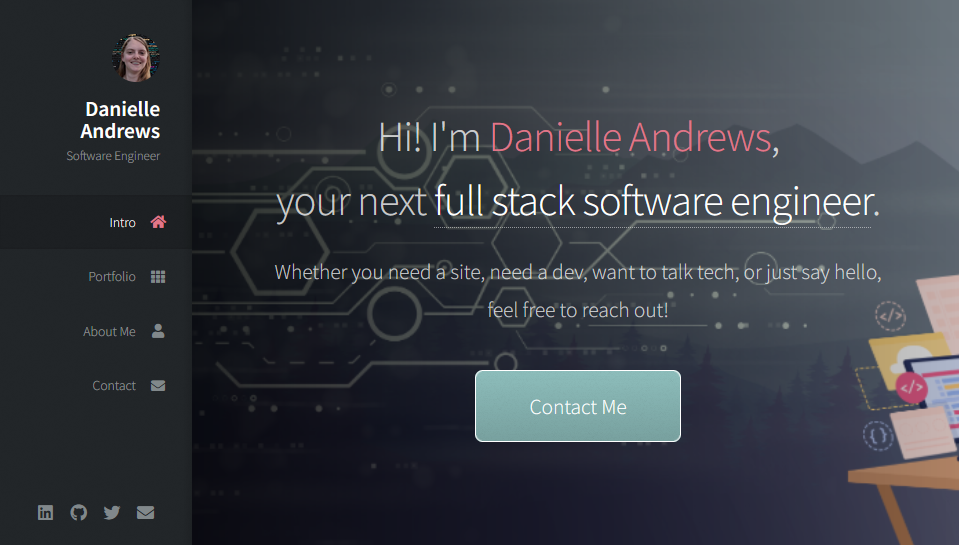
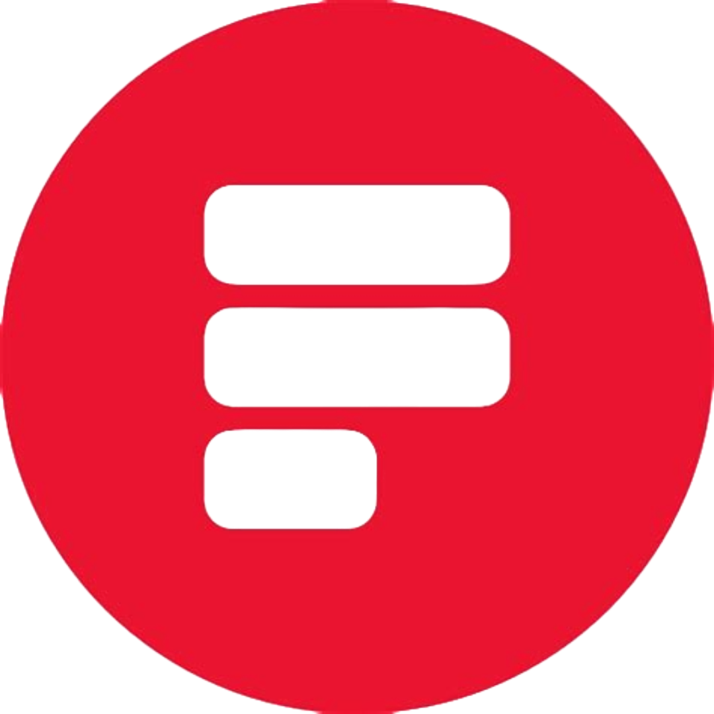

<h1 align="center">Welcome to Danielle Andrew's Portfolio!</h1>

  
  
  
  

> Freelance Web Developer / Software Engineering Portfolio

## Demo

  

## Author

👤 **Danielle Andrews**

- Github: [@DrAcula27](https://github.com/DrAcula27)
- LinkedIn: [@daniellerandrews](https://linkedin.com/in/daniellerandrews)

## Technologies

  
  
  
  
  
  

## Future Work

- Keep up-to-date with current projects.

## Attributions

- Template: Prologue by [HTML5 UP](https://www.html5up.net) | [@ajlkn](https://www.twitter.com/ajlkn) | aj@lkn.io
  > Free for personal and commercial use under the CCA 3.0 [license](https://www.html5up.net/license)
- Icons: [Font Awesome](https://www.fontawesome.io)
- jQuery: [jQuery.com](https://www.jquery.com)
- jQuery Scroll Events: [Scrollex](https://www.github.com/ajlkn/jquery.scrollex)
- Responsive Tools: [Responsive Tools](https://www.github.com/ajlkn/responsive-tools)
- Contact form: [Formspree API](https://www.formspree.io)

## Show Your Support

Give a ⭐️ if you liked this project!
